# ROV Management System

A full-stack web platform for managing **ROV (Remotely Operated Vehicle)** survey operations — built as my graduation thesis project at Hanoi University of Science and Technology (BKHN).

Field operators upload sensor logs, GPS tracks, sonar scans, DVL trajectories, and video/photo footage collected during a dive. The system stores, visualizes, and analyzes this data: interactive sensor charts with automatic anomaly detection, a synced video/telemetry playback ("cockpit") view, an AI-generated mission summary, and YOLOv8-based object detection on footage.

> There is no live telemetry link to the ROV. In real field conditions there's no connectivity underwater or on the boat, so operators upload data manually via the web app once the vehicle is back on shore.

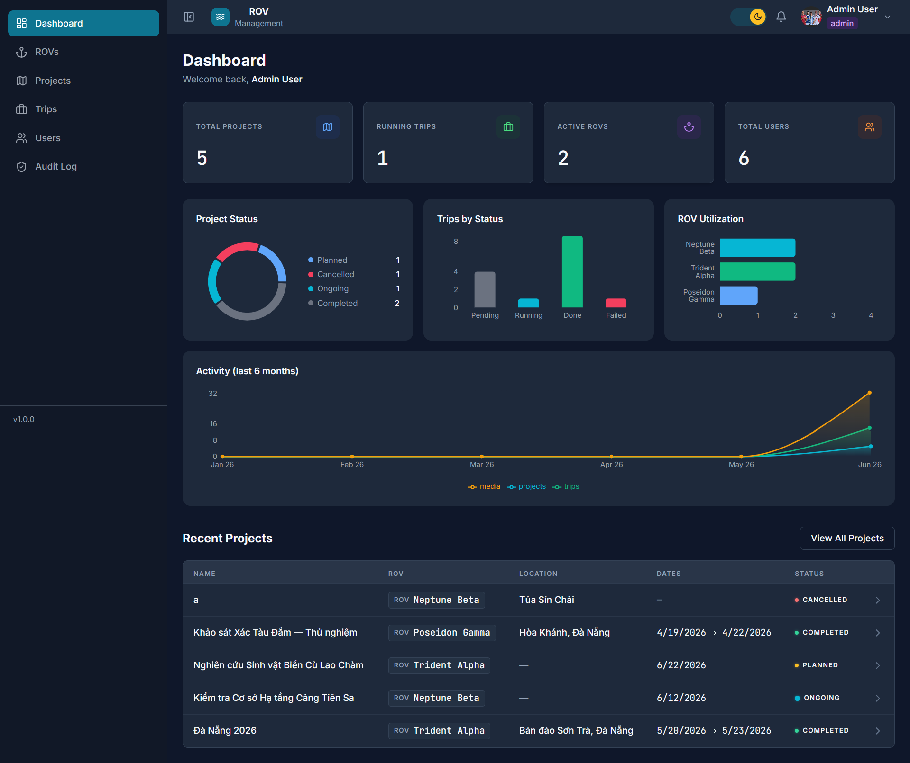

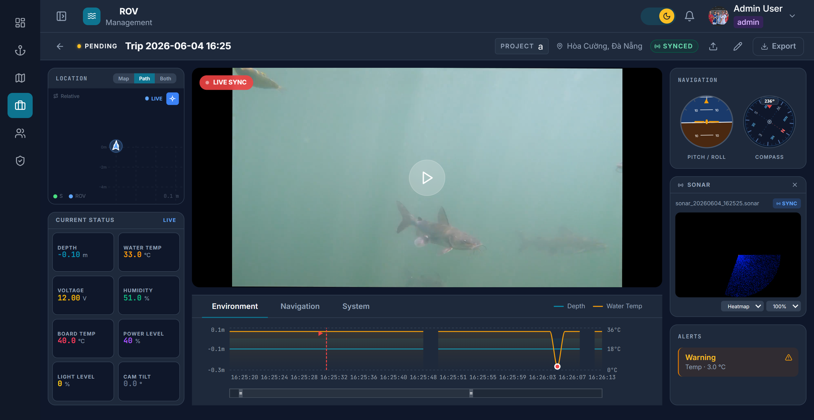

---

## Why this project

Most "CRUD admin panel" portfolio projects stop at forms and tables. This one is built around a real, messy data problem: ROVs produce multiple heterogeneous file types per dive (CSV sensor logs, JSON DVL trajectories, proprietary `.sonar` binaries, video, photos, and an optional manifest file) with inconsistent naming, European-formatted CSVs, and timezone quirks. The interesting engineering is in reconciling and visualizing that data coherently — not just storing it.

---

## Core features

### Data ingestion
- **Manual upload pipeline** — CSV sensor logs, JSON DVL trajectories, `.sonar` binary scans, video/photos (via S3 presigned URLs)
- **Folder upload** — select an entire dive folder in one go; the backend classifies each file by name pattern, auto-detects CSV delimiter (`,`/`;`) and decimal separator (`.`/`,` for European-format exports), and parses embedded timestamps
- **`trip.json` manifest support** — if the ROV's onboard system produced a session manifest, the backend cross-references it to auto-suggest precise (millisecond) recording start times for video files, including reconnect/disconnect events
- Multi-file support per dive: several sensor CSVs, DVL files, or sonar scans can coexist on one trip without overwriting each other, with automatic gap-handling on charts between files

### Visualization — the "cockpit" trip view
- Three-column, no-scroll layout: GPS map + live KPI cards (depth/temp/pressure) on the left, video/photo player with a collapsible playlist in the center, artificial-horizon and compass SVG gauges + anomaly alerts on the right, and a tabbed telemetry chart (Environment / Navigation / System) along the bottom with brush zoom/pan
- **Video ↔ sensor sync** — when a video's recording start time is known, a reference line sweeps across the telemetry chart in real time as the video plays, and the chart's zoom window auto-frames to match the active clip
- **Z-score anomaly detection** on depth/temperature/pressure readings, highlighted directly on the chart and listed in an alerts panel
- Raw Leaflet map plotting the dive's GPS fix, reverse-geocoded to a place name (OpenStreetMap Nominatim)
- Custom sonar scan viewer (HTML canvas) and DVL trajectory viewer (hand-rolled SVG with pan/zoom) — no off-the-shelf charting library fits sonar or local-frame trajectory data
- CSV and PNG export straight off the rendered charts

### AI & computer vision
- **Gemini 2.5 Flash** generates a bilingual (VI/EN) natural-language mission summary per project (trips, statuses, location, media count), run as an async Bull job so the API request isn't blocked on the model call
- **YOLOv8 object detection** (self-hosted Python/FastAPI microservice) runs on uploaded photos and videos — frame-sampled + object-tracked (ByteTrack) for video, with per-frame bounding boxes that move in sync with video playback
- Configurable detection model + confidence threshold per analysis run (built to support fine-tuned marine-object models alongside general YOLOv8n)
- **Evidence capture** — while watching footage, an operator can snapshot a still frame or mark a clip range as evidence, stored separately from the general media gallery, independently analyzable

### Platform
- JWT auth (15 min access / 7 day refresh) with silent auto-refresh, plus Google OAuth2
- Role-based access control — `admin` / `operator` / `viewer`, enforced on both API and UI
- Real-time in-app notifications over **Server-Sent Events** (job completion, status changes) — no WebSocket infra needed
- Redis-backed JWT blacklist for secure logout; rate limiting on auth routes in production
- Full audit log of write operations (who did what, to what, when)
- Dashboard with aggregate stats and activity timeline (7 parallel MongoDB aggregations)
- CSV/PDF export on every list view
- Full dark mode via a CSS-variable design-token system

| Sensor chart with anomaly detection | YOLOv8 detection overlay |
|---|---|
| 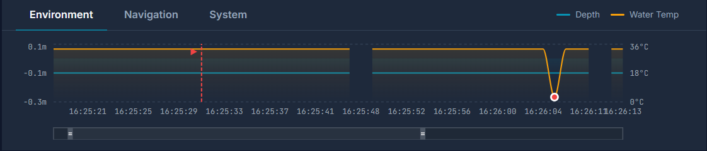 | 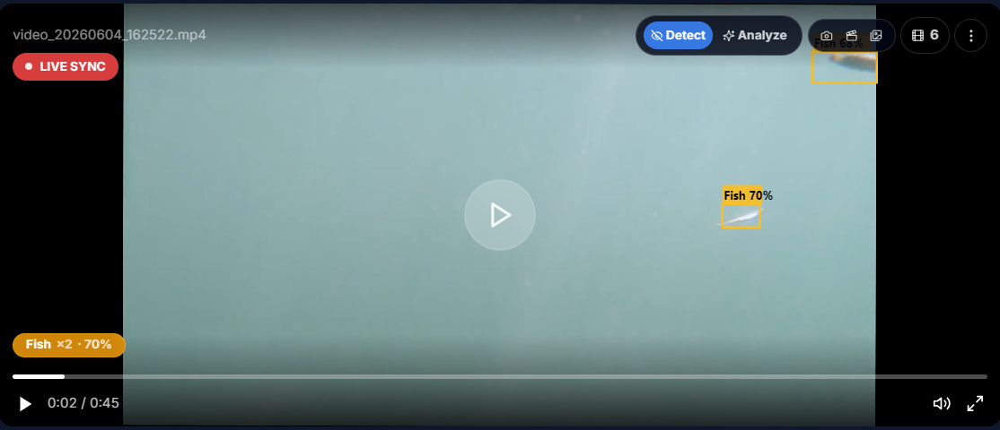 |

| AI-generated project summary | Evidence capture panel |
|---|---|
| 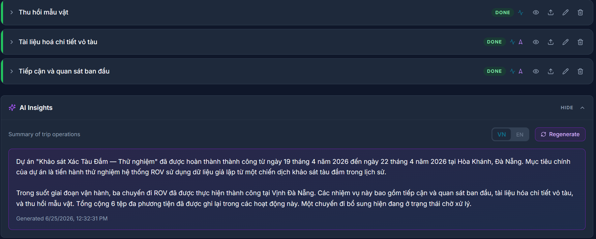 | 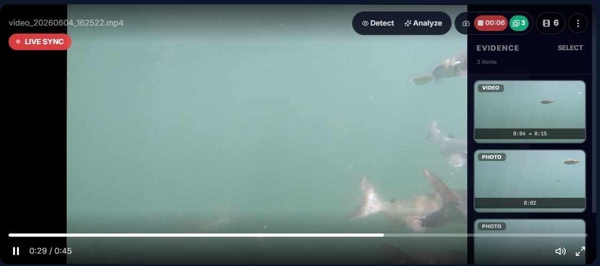 |

---

## Tech stack

**Frontend** — React 18 + Vite, Tailwind CSS (custom design-token theme, hand-built component library — no UI kit), TanStack Query + Zustand, Recharts, Leaflet/OpenStreetMap, react-hook-form, dnd-kit

**Backend** — Node.js + Express, MongoDB Atlas + Mongoose, Redis (ioredis), Bull (Redis-backed job queues), Passport.js (Google OAuth2), JWT, AWS S3 (presigned uploads)

**AI / Computer Vision** — Google Gemini 2.5 Flash (project summaries), YOLOv8 via a self-hosted FastAPI microservice (Python, `ultralytics`, OpenCV, ByteTrack), custom Z-score anomaly detector

**Infra** — Docker Compose (nginx reverse proxy + Node backend + Redis + YOLO service), deployed with the frontend on Vercel and the rest on a VPS

<details>
<summary>Full dependency list</summary>

**Backend:** express, mongoose, ioredis, bull, jsonwebtoken, bcryptjs, passport / passport-google-oauth20, @aws-sdk/client-s3 + s3-request-presigner, @google/generative-ai, multer, adm-zip, fluent-ffmpeg / ffmpeg-static, express-rate-limit, express-validator, helmet, morgan, cors

**Frontend:** react, react-router-dom, @tanstack/react-query, zustand, recharts, leaflet, react-hook-form, @dnd-kit/*, react-dropzone, jspdf / jspdf-autotable, date-fns, sonner, lucide-react, tailwindcss

**YOLO service:** fastapi, ultralytics (YOLOv8), opencv-python, bytetrack

</details>

---

## Architecture

```
┌──────────────┐      HTTPS       ┌───────────────────────┐
│  React (SPA) │ ───────────────► │   Express API         │
│  Vercel CDN  │ ◄─── JSON ────── │   (Node.js)           │
└──────────────┘      SSE stream  └──────────┬────────────┘
                                             │
                     ┌───────────────────────┼───────────────────────┐
                     ▼                       ▼                       ▼
              ┌─────────────┐        ┌────────────────┐        ┌─────────────┐
              │ MongoDB     │        │ Redis          │        │ AWS S3      │
              │ Atlas       │        │ (blacklist,    │        │ (presigned  │
              │             │        │  rate limit,   │        │  media      │
              │             │        │  Bull queues)  │        │  upload)    │
              └─────────────┘        └───────┬────────┘        └─────────────┘
                                             │
                              ┌──────────────┴───────────────┐
                              ▼                              ▼
                    ┌───────────────────┐            ┌──────────────────────┐
                    │ Bull worker:      │            │ Bull worker:         │
                    │ ai-summary        │            │ media-analysis       │
                    │ → Gemini 2.5 Flash│            │ → YOLOv8 microservice│
                    └───────────────────┘            │   (FastAPI, Python)  │
                                                     └──────────────────────┘
```

Async, potentially slow work (AI summary generation, video object detection) is enqueued as a Bull job and processed by a worker so the originating HTTP request returns immediately (`202 Accepted`); completion is pushed to the client over SSE rather than polled.

### Domain model
```
Project  (survey campaign — e.g. "Đà Nẵng coastal survey, June 2026")
  └── Trip   (one dive / recording session)
        ├── SensorData[]   (depth, temp, pressure, GPS, attitude, power — from CSV)
        ├── DVLData[]      (Doppler velocity log trajectory — from JSON)
        ├── SonarFile[]    (sonar scan — binary, custom viewer)
        ├── Media[]        (video / photo, S3-backed, optionally YOLO-analyzed)
        └── Snapshot[]     (operator-captured evidence: still frame or clip range)
```

---

## Project structure

```
rov-management/
├── backend/src/
│   ├── app.js                  # Express app, route registration
│   ├── config/                 # db, s3, redis, queue, passport
│   ├── middleware/              # auth (JWT + RBAC), rate limiting, error handling
│   ├── utils/                   # response envelope, JWT helpers, filename-timestamp parsing
│   └── modules/                 # one folder per domain, each: model / controller / service / routes
│       ├── auth/  users/  rovs/  projects/  trips/
│       ├── sensor/  dvl/  sonar/  media/  snapshots/
│       ├── ai/  stats/  notifications/  audit/
│
├── frontend/src/
│   ├── store/                   # Zustand: auth, theme
│   ├── lib/                     # axios (auto-refresh), CSV/PDF export, dnd config
│   ├── router/
│   ├── components/shared/       # Layout, Sidebar, Navbar, ProtectedRoute, ExportMenu
│   └── features/
│       ├── auth/  dashboard/  rovs/  projects/  trips/
│       ├── media/  users/  profile/  audit/
│       └── trips/components/     # SensorChart, SonarViewer, TrajectoryViewer,
│                                  # ArtificialHorizon, CompassRose, ROVDataUpload, evidence/
│
├── yolo-service/                 # FastAPI microservice — YOLOv8 inference (image + video/tracking)
├── nginx/                        # reverse proxy config for VPS deployment
└── docker-compose.yml            # redis + backend + yolo + nginx
```

---

## Role-based access control

| Capability | admin | operator | viewer |
|---|:---:|:---:|:---:|
| Manage users | ✅ | ❌ | ❌ |
| Create/edit ROVs, projects, trips | ✅ | ✅ | 👁 read-only |
| Upload media / sensor / sonar / DVL data | ✅ | ✅ | ❌ |
| Bulk delete media | ✅ | ❌ | ❌ |
| Generate AI summary | ✅ | ✅ | ❌ |
| View audit log | ✅ | ❌ | ❌ |
| CSV/PDF export | ✅ | ✅ | ❌ |

---

## Running locally

```bash
# Redis (required for auth blacklist + Bull queues)
docker run -d -p 6379:6379 redis:alpine

# Backend
cd backend
npm install
npm run dev            # http://localhost:5000

# Frontend
cd frontend
npm install
npm run dev            # http://localhost:5173

# YOLOv8 microservice (optional — needed for object detection)
cd yolo-service
pip install -r requirements.txt
uvicorn main:app --reload --port 8000
```

Environment variables (`backend/.env`):

```env
MONGODB_URI=...
JWT_SECRET=...
JWT_REFRESH_SECRET=...
REDIS_URL=redis://localhost:6379

AWS_ACCESS_KEY_ID=...
AWS_SECRET_ACCESS_KEY=...
AWS_REGION=ap-southeast-1
S3_BUCKET=...

GOOGLE_CLIENT_ID=...
GOOGLE_CLIENT_SECRET=...
GOOGLE_CALLBACK_URL=http://localhost:5000/api/v1/auth/google/callback

GEMINI_API_KEY=...
YOLO_SERVICE_URL=http://localhost:8000

SMTP_HOST=smtp.gmail.com
SMTP_PORT=587
SMTP_USER=...
SMTP_PASS=...

CLIENT_URL=http://localhost:5173
```

### Test accounts (after seeding)
```
admin@rov.local    / Admin@123
operator@rov.local / Operator@123
viewer@rov.local    / Viewer@123
```
Seed with `cd backend && node src/scripts/seed.js` (or `seed-full.js --reset` for a fuller demo dataset).

---

## Deployment

```
Vercel          → frontend (React SPA, CDN)
MongoDB Atlas   → database
AWS S3          → media storage
VPS (Docker)    → nginx (reverse proxy) + Node backend + Bull workers
                  + YOLOv8 FastAPI service + Redis
```

Everything server-side runs from a single `docker-compose up` on the VPS — chosen over splitting across managed services because Redis needs sub-millisecond latency to the backend for the auth blacklist/queues, and the YOLOv8 model needs ~1–1.5GB of RAM for inference, which no relevant free tier offers.

---

## Testing

- **Functional/API tests** — automated Node.js script hitting auth, RBAC, validation, CRUD, and pagination paths (`backend/src/scripts/functional-test.js`)
- **Load testing** — a plain Node.js concurrency script and an Artillery config (`backend/src/scripts/load-test.js`, `artillery.yml`) covering warm-up → ramp-up → peak phases
- **Manual QA** — responsive layout (375px / 768px / 1440px), dark mode, RBAC per role, upload edge cases (oversized files, malformed CSVs, slow network), Lighthouse performance/accessibility passes

---

## Notes on scope

This was built solo as a graduation project over several months, prioritizing breadth of realistic ROV-operations features (multi-format data ingestion, sensor visualization, AI summary, computer vision, evidence capture) over enterprise hardening. There's no live device telemetry — everything is post-dive, file-based upload by design, matching how the target vehicles actually operate in the field (no connectivity underwater or offshore).

---

## More screenshots

| Projects list | Trips list |
|---|---|
| 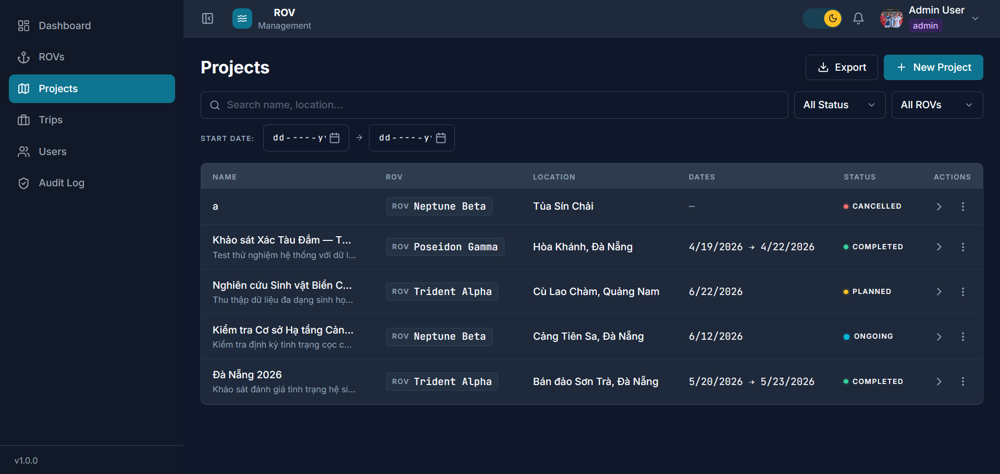 | 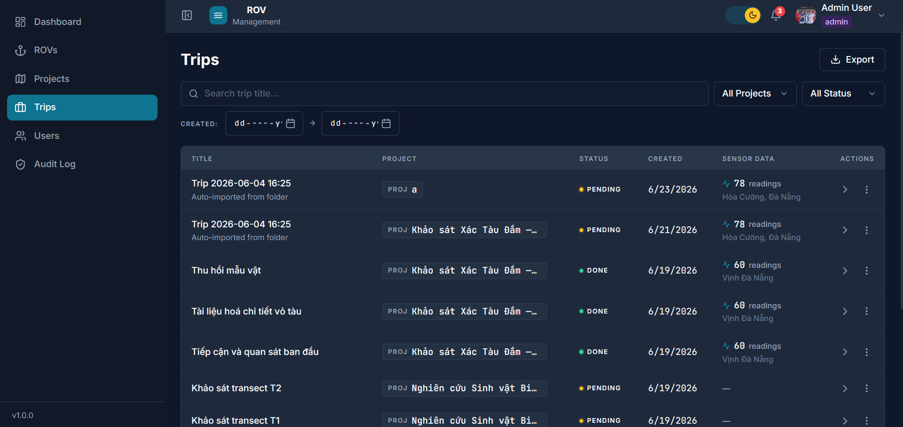 |

| Project detail | Users management (admin) |
|---|---|
| 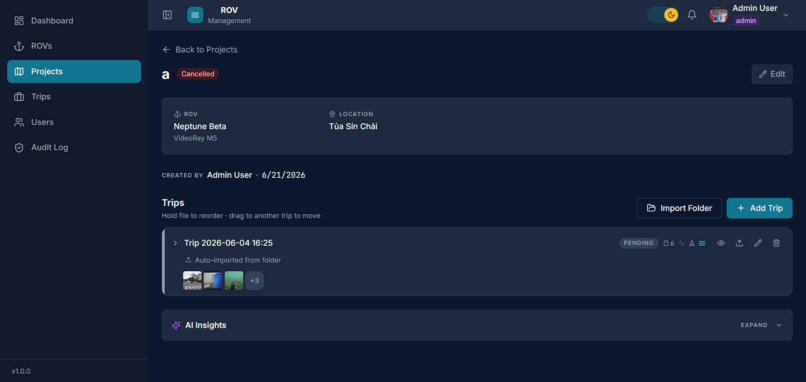 | 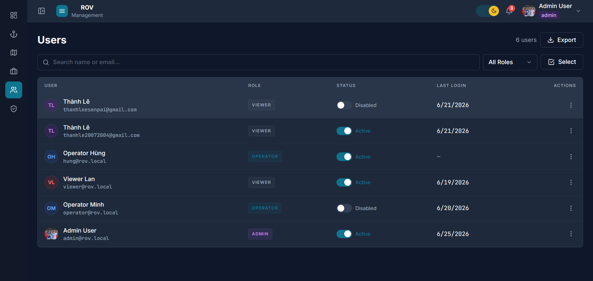 |

| Audit log | AI analysis settings popover |
|---|---|
| 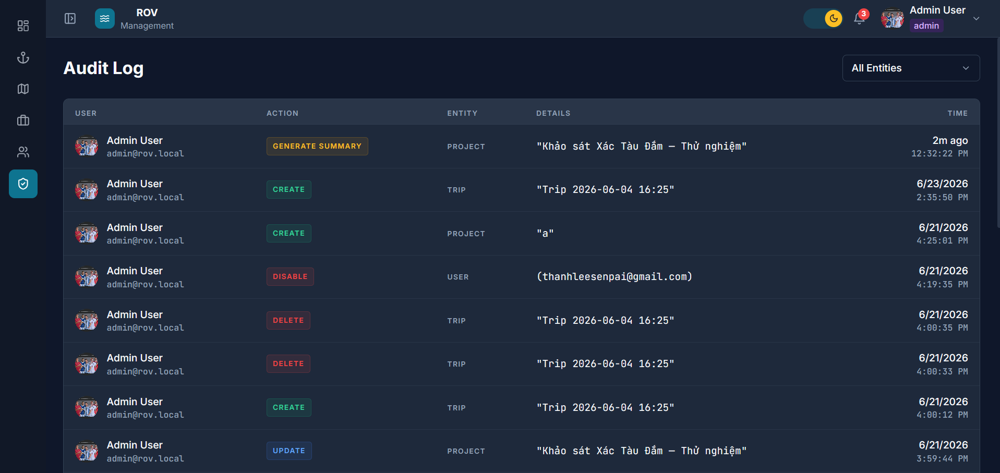 | 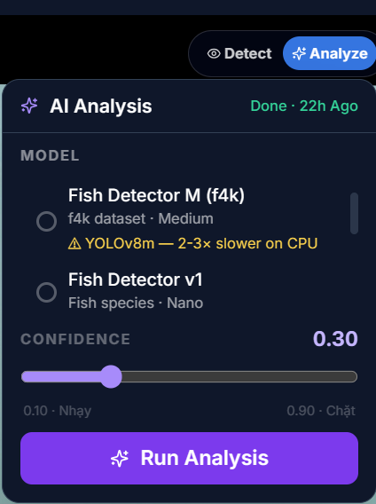 |

| Login | Real-time notifications |
|---|---|
| 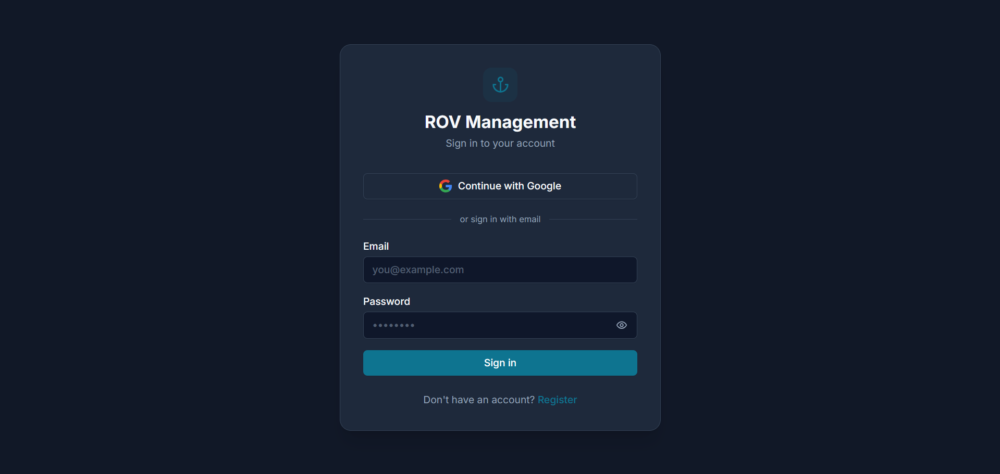 | 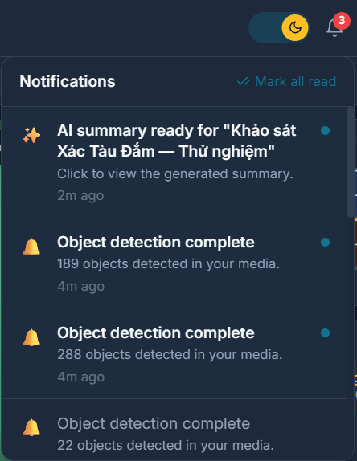 |
